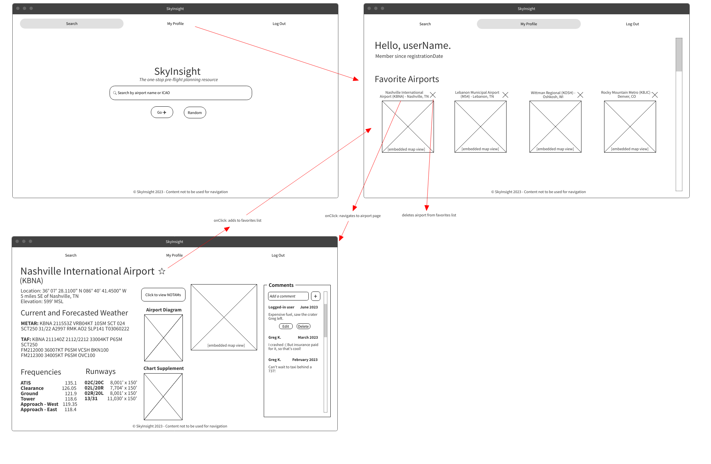
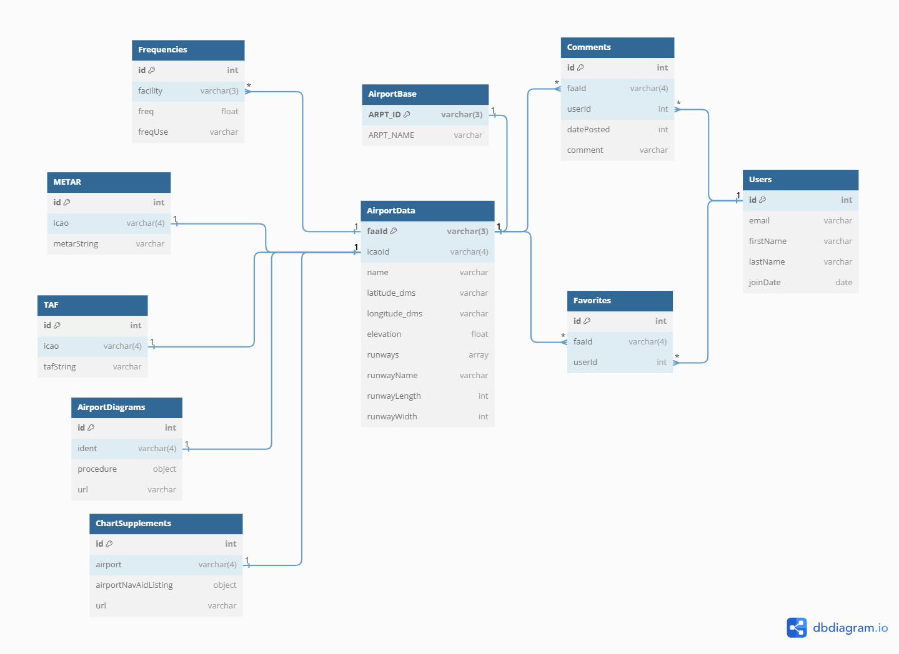

**SkyInsight** is a one-stop pre-flight planning resource and hangout for general aviation pilots, providing information required by 14 CFR 91.103 for any airport in the National Airspace System and creating a hub for pilots to share reviews, stories etc. for airports they have visited.

## Tech Stack

**SkyInsight** was written using the React framework, bootstrapped with [Create React App](https://github.com/facebook/create-react-app). It was 100% styled using vanilla CSS (no UI libraries!). Using a custom-built light Node Express API, SkyInsight interfaces with data from:
- [FAA's 28-Day NASR subscription](https://www.faa.gov/air_traffic/flight_info/aeronav/aero_data/NASR_Subscription/), some of which has made conveniently available through the [aeroinfo](https://github.com/kdknigga/aeroinfo) API
- [Aviation Weather Center](https://beta.aviationweather.gov/data/api/)
- [Google Maps API](https://developers.google.com/maps/documentation/javascript)
- [VFRMap](https://vfrmap.com/)
- A locally-hosted "dummy server" using [JSON Server](https://www.npmjs.com/package/json-server) which accepts full CRUD operations

Developed using VSCode, GitHub, JSON-Server, Node Express, Create React App, and Postman API.

## Demonstration

View a quick demonstration of **SkyInsight** here:

## Install

**SkyInsight** requires the [Node.js](https://nodejs.org/en) runtime environment. Follow their instructions for install.

**SkyInsight** requires two local servers to run:
- [SkyInsight JSON-Server](https://github.com/DavidBartek/sky-insight-server) - database handling persistent data storage for users, as well as select airport information (frequencies, Chart Supplements & Airport Diagrams for limited airports for cycle ending 10/5/23) using [JSON-server](https://github.com/typicode/json-server). (Just a heads up, it's a big database!)
    - Install JSON Server from link above.
    - Navigate in your browser to the [repo](https://github.com/DavidBartek/sky-insight-server).
    - In your terminal, run `git clone` + repo's SSH to download.
    - Once in the database directory, run in terminal: `json-server database.json -p 8088 -w` (to quit: `Ctrl + C`)
- [SkyInsight Node Express API](https://github.com/DavidBartek/sky-insight-express) - a custom-built Node Express API for interfacing with SkyInsight's many external datasets, using [Node Express](https://expressjs.com/en/starter/installing.html).
    - Navigate in your browser to the [repo](https://github.com/DavidBartek/sky-insight-express)
    - In your terminal, run `git clone` + repo's SSH to download.
    - Once in the app directory, follow [Node Express's installation directions](https://expressjs.com/en/starter/installing.html).
    - Run in terminal: `node app.js` (to quit: `Ctrl + C`)

**Once the above is up and running, SkyInsight is ready to rock!**
- In your terminal, run `git clone` + this repo's SSH while in your target directory.
- Once inside the **SkyInsight** directory, run `npm start` (to quit: `Ctrl + C`). **SkyInsight** will automatically open in your default browser.

## Some Important Notes

### Secret Key for Google Maps

A Google Maps API key has been omitted from this repository. For embedded Google Maps to work properly:
- obtain a private API key [here](https://developers.google.com/maps/documentation/javascript/get-api-key)
- create a JS file in the `src` directory named `GoogleAPIKey.js`
- In `GoogleAPIKey.js`, copy + paste: `export const googleAPIKey = "YourAPIKeyHere"`

### For the demonstrational purposes of this app, not all information is currently up to date.
Information which is up to date:
- Basic airport information (ownership, location, runways, etc.)
- Current METARs and TAFs

Information which is NOT up to date:
- Frequency data
- Chart Supplement and Airport Diagram, if available

### Finally...
**SkyInsight** is for demonstration purposes only, and is not to be used for navigation. Go use a proper EFB :)

## Wireframe

## ERD

